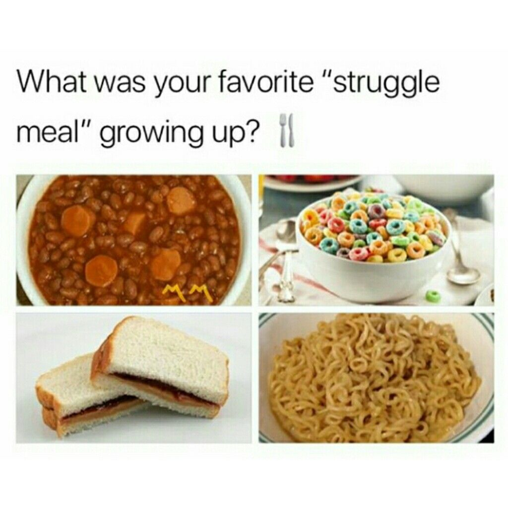

+++
title = "𝔹𝕖𝕤𝕡𝕣𝕖𝕔𝕙𝕦𝕟𝕘 ℙ𝕣𝕠𝕛𝕖𝕜𝕥𝕚𝕕𝕖𝕖𝕟"
date = "2020-09-02"
draft = false
pinned = false
image = "34c7fce23b733d548fc450aab141450a.jpg"
+++
#### Fashion Beauty Lifestyle Blog

Heute haben ich und mein Teammitglied nochmal darüber nachgedacht, welche unserer Ideen umgesetzt werden können und welche wir weiterentwickeln müssen. Aus diesem Gespräch haben wir gemerkt, dass unsere Idee mit der Beauty Fashion Lifestyle Website schwer umzusetzen ist, da viele ähnliche Webseiten, Blogs und Instagram-Pages über die gleichen Themen bereits existieren. Ein weiteres Problem ist, dass wir beide nicht genug Beauty Produkte haben und wir kleine Influencer sind.

#### Abfalleimer für Masken

Eine weitere Idee war der Abfalleimer für die Masken. Wir wollten einen Abfalleimer bauen, der ein Pedal, Deckel und eine Art Messer hat, mit welchem man die Elastikbänder der Maske abschneiden kann. Im Internet habe ich gelesen, dass Tiere sich in den Elastikbändern verfangen können und wie wir in Bern gesehen haben, liegen sehr viele Masken auf dem Boden herum.

#### Website für Rezepte 

Eine Idee von meinem Teammitglied war eine Website für Rezepte. Dabei haben wir uns überlegt, dass wir Rezepte für Studenten kreieren wollen, da nicht alle Schüler gleich gut kochen können. Unser Ziel ist es, möglichst günstige, schnelle und einfache Gerichte mit saisonalen Zutaten herzustellen. Eine Webseite die uns gefallen hat und die wir uns zum Vorbild nehmen ist tasty.co. Unsere Website soll auch sogenannte"struggle meals" beinhalten, jeder hat schon mal ein struggle meal gegessen, ein einfaches Beispiel dafür sind cornflakes, toast oder mac and cheese. 

