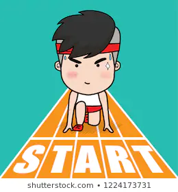

+++
title = "𝔼𝕣𝕤𝕥𝕖 𝕊𝕔𝕙𝕣𝕚𝕥𝕥𝕖 ℝ𝕖𝕫𝕖𝕡𝕥𝕖-𝕎𝕖𝕓𝕤𝕚𝕥𝕖"
date = "2020-09-09"
draft = false
pinned = false
image = "erste-schritte-2.jpg"
+++
Ich und mein Teammitglied haben uns entschieden, die Idee mit der Rezepte-Website umzusetzen. Dafür haben wir uns folgende Schritte überlegt:

1. Rezepte entwerfen
2. Fotos von den einzelnen Schritten und fertigem Rezept machen
3. Fotos in Photoshop bearbeiten
4. Name für Website erfinden
5. Aufbau der Website (Rubriken, Unterthemen, Buttons) überlegen
6. Website erstellen auf carrd, weebly, wix oder jimdo
7. Challenges (Madame Frigo, 5 Zutaten für 1 Gericht) erfinden

Der nächste Lernprozess wird für mich die Bearbeitung der Fotos in Photoshop sein, da ich mich noch nicht gut damit auskenne. 

