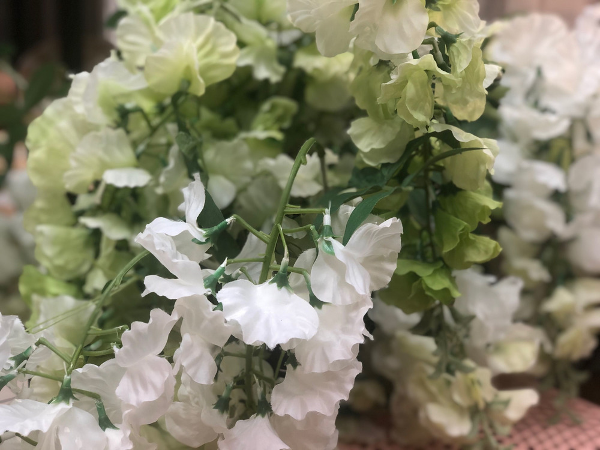

+++
title = "𝔽𝕝𝕠𝕣𝕒𝕝 𝔽𝕒𝕟𝕥𝕒𝕤𝕪"
date = "2020-08-19"
draft = false
pinned = false
image = "microsoftteams-image-5-.jpg"
+++
Heute habe ich mit meinem Teammitglied zusammen eine Website für einen Blumenladen auf carrd erstellt. 

Wir haben uns zuerst überlegt, was alles in einen Blumen Webshop gehört und sind dann ins Wankdorf gegangen. Zuerst waren wir im casa, das casa ist ein Laden für die neuesten Interior-trends. Natalia hat auf ihrem Smartphone Bilder von den Blumen im casa gemacht. Danach sind wir noch ins Coop und haben dort weitere Fotos gemacht.

Für die Website haben wir ein Bild von den Blumen im casa genommen, welches uns beiden sehr gefallen hat. Ich und Natalia haben uns vor dem Erstellen der Website ein paar Namen überlegt, darunter waren Floral Fantasy und Royal Flowers. Schlussendlich haben wir uns für Floral Fantasy entschieden. Anschliessend haben wir die Bilder hochgeladen und eine Adresse und E-Mail erfunden.

