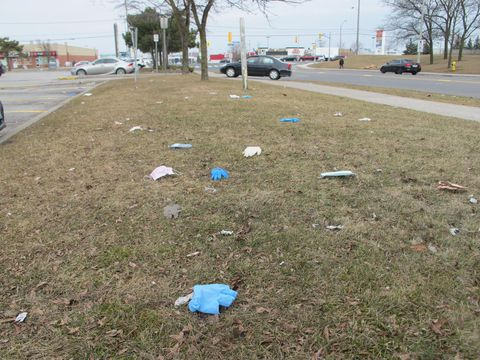

+++
title = " 𝕌𝕞𝕗𝕣𝕒𝕘𝕖 𝕚𝕟 𝔹𝕖𝕣𝕟 𝕫𝕦 𝕦𝕟𝕤𝕖𝕣𝕖𝕣 𝕀𝕕𝕖𝕖"
date = "2020-08-26"
draft = false
pinned = false
image = "beauty-fashion-lifestyle.jpg"
+++
### Umfrage

Ich und mein Teammitglied sind heute mit dem Tram nach Bern gefahren und haben dort in der Umgebung eine Umfrage durchgeführt und uns überlegt, wo wir Probleme sehen. Wir haben Mädchen in unserem Alter gefragt, was sie zu unserer Idee, eine Beauty/Fashion/Lifestyle Website aufzustellen, denken.

Fast alle Mädchen haben gesagt, dass es so etwas schon gibt und sie bei Fragen einfach eine schnelle Google-Suche machen oder auf YouTube ein paar Videos anschauen. Einige haben auch Instagram und Tik Tok erwähnt. Viele haben auch erwähnt, dass es eher lange dauert um auf gute oder nützliche Ergebnisse auf Google zu kommen. 

Das wird ein Problem werden für unsere Website, da diese zuerst genug Besucher bekommen muss, damit sie bei den Google-Suchen auf der ersten Seite so hoch oben wie möglich auftaucht. Für viele kleine Beauty/Fashion/Lifestyle Influencer, die schon viele Jahre Tipps geben, existiert das gleiche Problem. 

### Probleme

Bevor wir wieder zurück gefahren sind haben wir uns unserer zweiten Aufgabe gewidmet und dabei gemerkt, dass es auf dem Boden sehr viel Abfall hat und jetzt vor allem Masken wegen der Maskenpflicht im Öffentlichen Verkehr.

