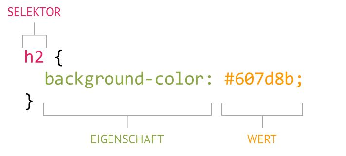
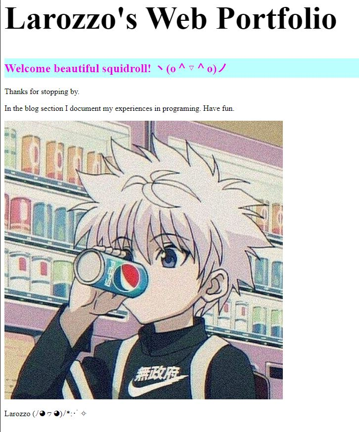

+++
title = "ℂ𝕠𝕕𝕖 𝕄𝕒𝕜𝕖𝕣𝕪 𝕋𝕖𝕚𝕝 𝟛"
date = "2020-10-28"
draft = false
pinned = false
image = "visual-studio-code.jpg"
+++
##### Tätigkeiten

Heute haben ich und mein Teammitglied an unserer Website weiter programmiert. Ich habe die Schriftgrösse und Farbe meiner Überschrift mithilfe der CSS-Werte verändert.

##### Was habe ich heute gelernt?

Ich habe gelernt dass eine CSS-Regel aus 3 Elementen besteht, nämlich:

* Selektor
* Eigenschaft
* Wert

