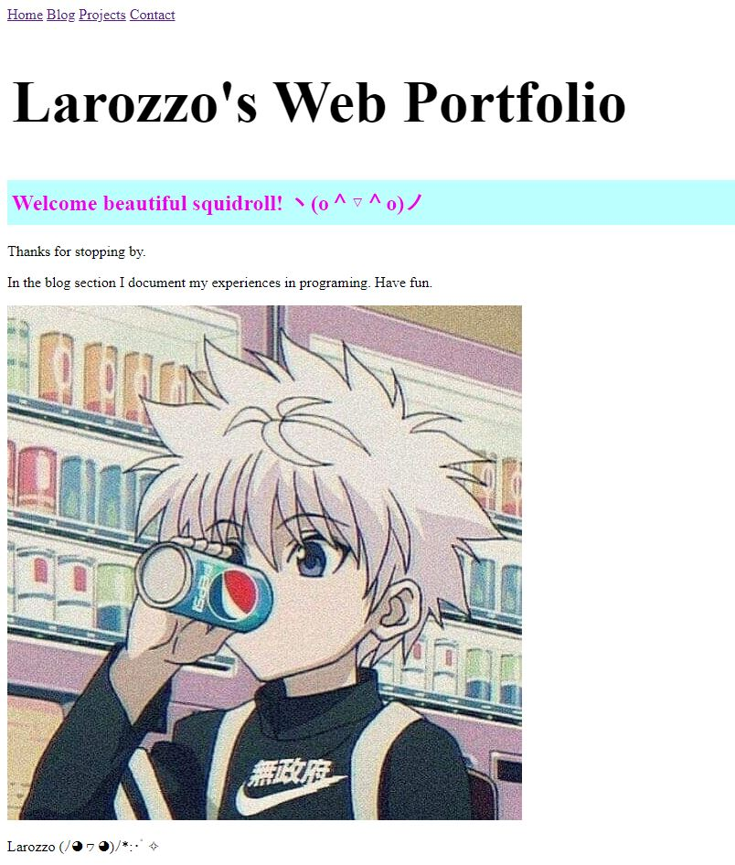

+++
title = "ℂ𝕠𝕕𝕖 𝕄𝕒𝕜𝕖𝕣𝕪 𝕋𝕖𝕚𝕝 𝟝"
date = "2020-12-02"
draft = false
pinned = false
image = "bread.jpg"
+++
#### Präsentation Ergebnisse

Heute haben ich und mein Teammitglied die Bilder von unserer gemeinsamen Koch-Lektion am 18. November der Klasse präsentiert.

#### code.makery

Auf code.makery bin ich heute bis zu Teil 5 gekommen, in dem man lernt, wie man verschiedene Seiten für Blogeintrage, Kontakte und weiter Projekte erstellt. 

Im Moment sieht meine Website so aus:

