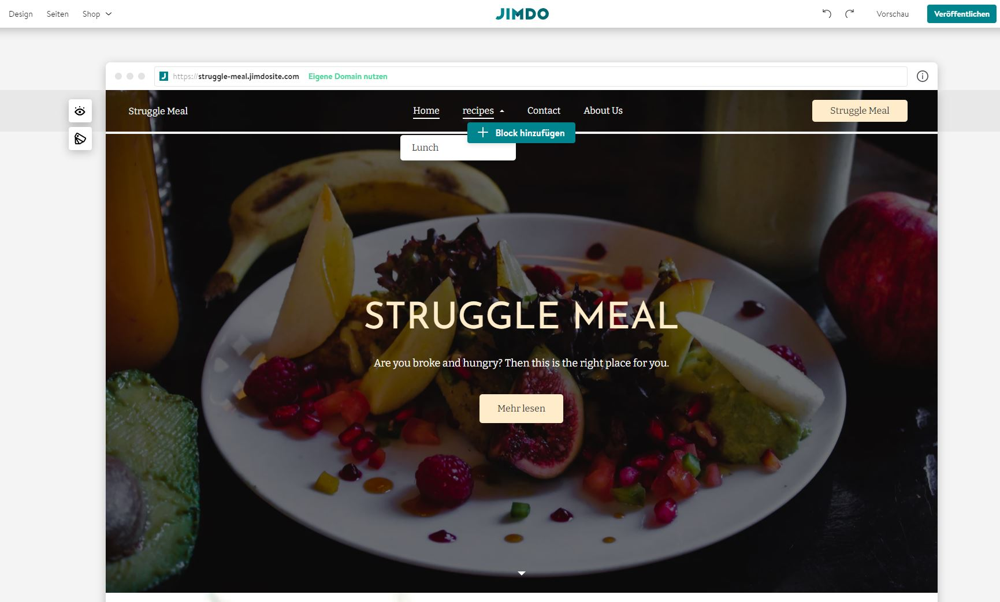
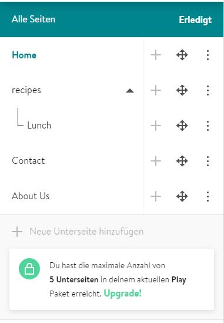

+++
title = "ℕ𝕖𝕦𝕒𝕟𝕗𝕒𝕟𝕘"
date = "2021-01-13"
draft = false
pinned = false
image = "jimdo-homepage.jpg"
+++
### Beendung alte Website

Heute merkten ich und mein Gruppenmitglied, dass das Programmieren der Website sehr kompliziert für uns ist. Aus diesem Grund haben wir uns entschieden die Webseite auf 2 Wege zu erstellen:

Mein Gruppenmitglied programmiert unsere Website mit einer Vorlage von Start Bootstrap und ich erstelle die gleiche Website auf jimdo.

#### Erste Probleme mit Jimdo

Der Umgang mit Jimdo ist sehr einfach und darum hat mir diese Art von Webseitenerstellung sofort gefallen, doch nachdem ich mehrere Unterseiten hinzufügen wollte ging dies nicht mehr, weil man nach 5 Seiten Geld bezahlen muss, um noch mehr Seiten zu hinzuzufügen. Aus diesem Grund habe ich mit der Bearbeitung aufgehört und mir überlegt, wie wir unsere Rezepte anderswo veröffentlichen können.

#### Neue Idee: Food Instagram

Da ich und mein Gruppenmitglied schon mehrere Male von Instagram gesprochen haben und beide vielen Food Profilen darauf folgen, ist uns in den Sinn gekommen, dass wir auch so eines gestalten können. Dafür müssten wir keine Webseite programmieren, wir könnten mehr Leute erreichen und wir müssten kein Geld ausgeben. Doch bevor wir diese Idee durchziehen, müssen wir uns  noch genauer überlegen, ob wir nicht doch die Webseite auf Studio Visual Core programmieren wollen. Ausserdem wollen wir unsere geleistete Arbeit nicht einfach wegschmeissen und nochmal eine Planänderung machen.