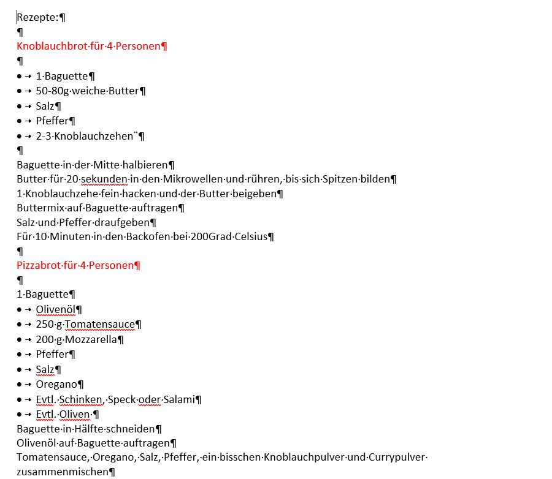

+++
title = "𝕌𝕟𝕤𝕖𝕣𝕖 𝕖𝕣𝕤𝕥𝕖𝕟 𝔾𝕖𝕣𝕚𝕔𝕙𝕥𝕖"
date = "2020-11-11"
draft = false
pinned = false
image = "ramen-bowl.jpg"
+++
### 11. November

Ich und mein Teammitglied haben uns auf die nächste Woche vorbereitet und uns vorgenommen 4 Gerichte zu kochen und dabei den Prozess zu dokumentieren. Wir haben uns entschieden, Pizza- und Knoblauchbrot, Instant Ramen und Nutella mug cake zu kochen. Aus diesem Grund haben wir eine Einkaufsliste erstellt. 

### 18. November

Nach dem Einkaufen haben ich und mein Teammitglied Fotos von unseren Zutaten und den einzelnen Zubereitungs-Schritten gemacht. Schlussendlich haben wir alle Gerichte ausser den Nutella mug cake gekocht und unsere Vorgehensweise und alle nötigen Zutaten in diesem Word-Dokument festgehalten:

