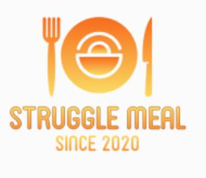

+++
title = "𝔸𝕣𝕖 𝕪𝕠𝕦 𝕓𝕣𝕠𝕜𝕖 𝕒𝕟𝕕 𝕙𝕦𝕟𝕘𝕣𝕪?"
date = "2020-12-16"
draft = false
pinned = false
image = "website-min-3-4-.png"
+++
#### Unsere Website nimmt Form

Heute haben ich und mein Teammitglied mit dem Programmieren unserer Website gestartet. Auf der Website www.themewagon.com haben wir eine passende Vorlage gefunden, die wir jetzt mit Studio Visual Core bearbeiten.

Wir haben uns auf den Namen "Struggle Meal" geeignet und unser Slogan lautet: "Are you broke and hungry?". 

Zusammen haben wir auf www.brandcrowd.com unser Logo gestaltet, welches so aussieht:

