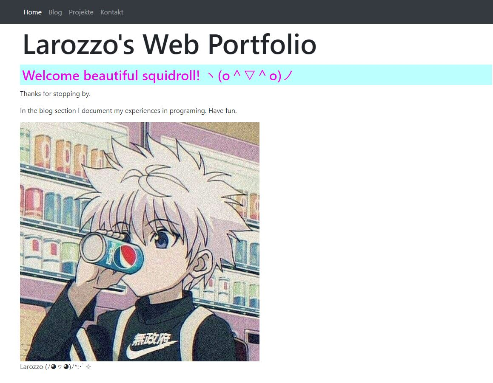

+++
title = "𝔹𝕠𝕠𝕥𝕤𝕥𝕣𝕒𝕡"
date = "2020-12-09"
draft = false
pinned = false
image = "bootstrap.png"
+++
#### Mein Web Portfolio

Heute habe ich gelernt, dass Frameworks die Gestaltung von Webseiten erleichtern. Zum Beispiel mit Bootstrap sehen die Elemente besser aus und werden in allen Browsern gleich dargestellt. Manche Styles aus dem Bootstrap-CSS werden direkt auf HTML-Elemente angewandt, sie werden aber erst aktiviert, wenn man eine entsprechende CSS-Klasse hinzufügt. Ausserdem habe ich erfahren, dass es div-Elemente gibt, welche Elemente zu einem Block gruppieren. Die span-Elemente hingegen sind nur so breit wie ihr Inhalt.

