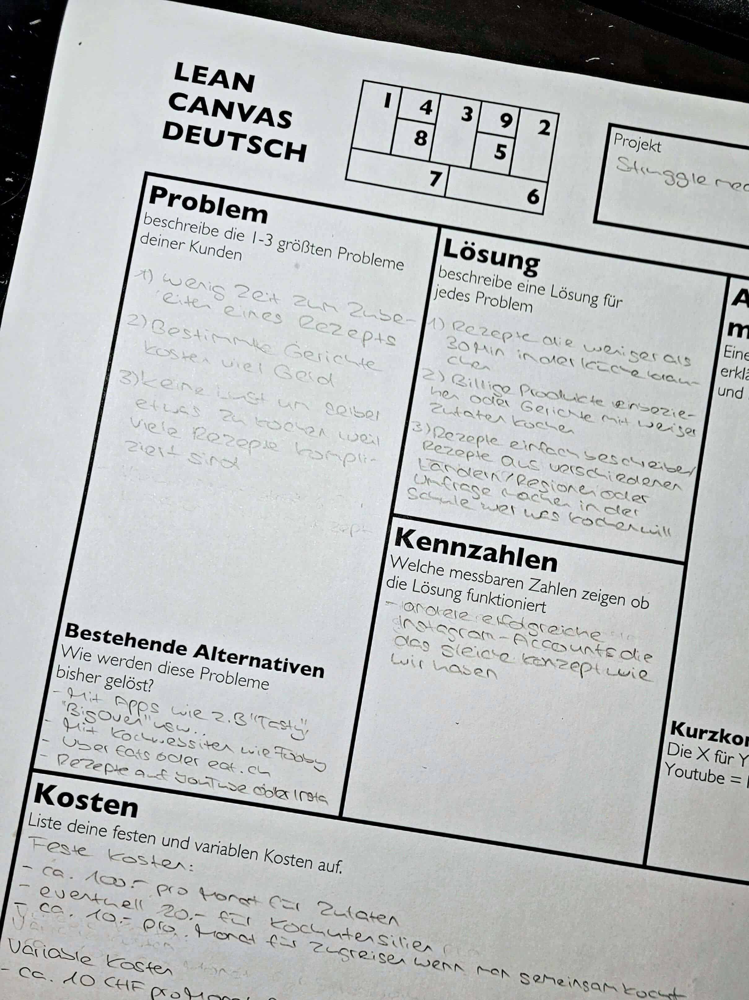
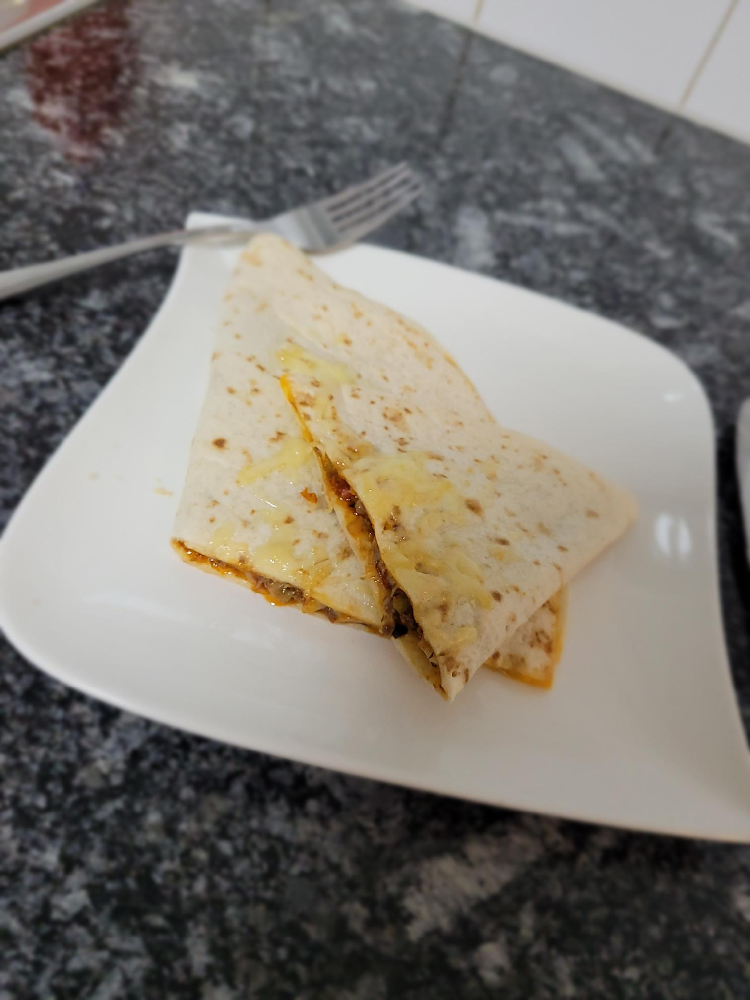

+++
title = "𝕃𝕖𝕒𝕟 ℂ𝕒𝕟𝕧𝕒𝕤"
date = "2021-02-03"
draft = false
pinned = false
image = "lean-canvas.png"
+++
#### Lean Canvas

Heute haben ich und mein Gruppenmitglied ein Lean Canvas ausgefüllt, welches Leuten dabei hilft, einen Überblick über ihr Projekt zu bekommen. Dies funktioniert in 9 Feldern und jedes Feld beschreibt ein Thema genauer. Unser Lean Canvas sieht im Moment so aus:

Wir konnten alle Felder ausser das Alleinstellungsmerkmalfeld und den Unfairen Vorteil ausfüllen, da unser Projekt schon existiert und viele vor uns schon die gleiche Idee hatten. Aus diesem Grund ist es schwierig festzulegen, warum unsere Lösung anders und beachtenswert ist.

#### Kochen

Da wir heute von zuhause aus arbeiten durften habe ich Zeit gehabt zum kochen. Ich habe mich entschieden aus den Resten von gestern ein Fladenbrot mit Fleisch- und Käsefüllung zu machen.

