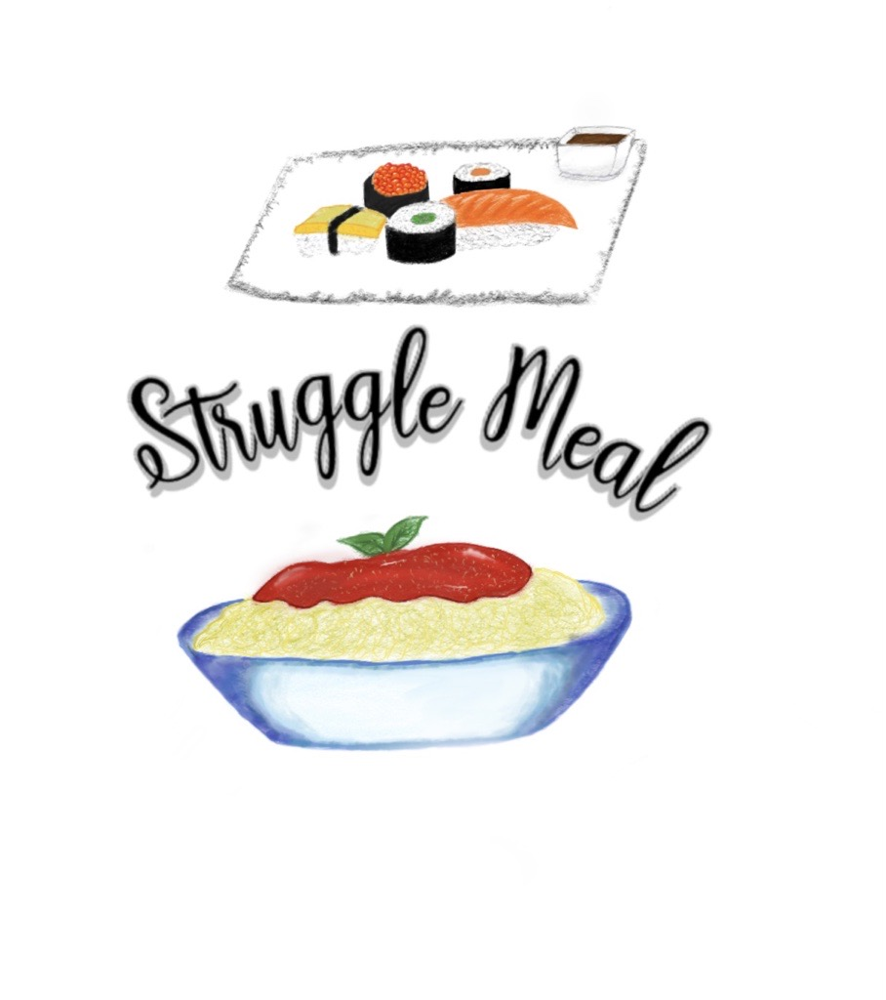

+++
title = "𝕃𝕠𝕘𝕠ä𝕟𝕕𝕖𝕣𝕦𝕟𝕘"
date = "2021-03-24"
draft = false
pinned = false
image = "new-logo.png"
+++
Ich und mein Gruppenmitglied haben unser Logo geändert, weil wir gemerkt haben, dass unser altes ein bisschen langweilig aussieht. Die letzten Male haben wir auf der SketchBook-App ein neues Logo gezeichnet, welches so herausgekommen ist:

Wir haben die Schrift mithilfe der Website fontmeme.com gestaltet und haben uns überlegt, wie wir unsere Küchen zusammen in einem Logo darstellen können.

#### Pläne für die nächste Woche

Nächste Wochen haben wir geplant, neue Rezepte auszuprobieren, darunter auch ein paar Desserts. Ausserdem haben wir ein paar Klassenkameraden überzeugt, unsere Rezepte auf Instagram auszuprobieren und diese mit Fotos zu dokumentieren. Somit können wir analysieren, ob unsere Rezepte machbar sind und wir freuen uns schon auf die Bilder. <!--StartFragment-->

|          |
| -------- |
|  ＼(＾▽＾)／ |

<!--EndFragment-->