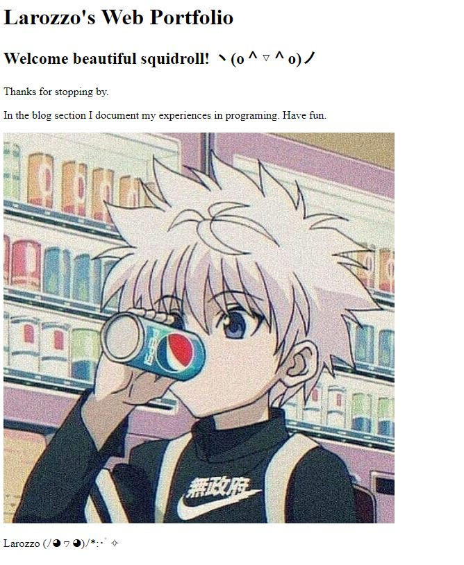

+++
title = "𝕄𝕖𝕚𝕟 𝕖𝕣𝕤𝕥𝕖𝕤 𝕄𝕒𝕝 ℙ𝕣𝕠𝕘𝕣𝕒𝕞𝕞𝕚𝕖𝕣𝕖𝕟"
date = "2020-10-21"
draft = false
pinned = false
image = "programmieren.jpg"
description = ""
+++
### Distanzunterricht

Heute haben wir im WEB-Unterricht zum ersten mal Distanzlernen gehabt. Am Anfang der Lektion wurde die Einführung per Videokonferenz auf Teams durchgeführt, dann habe ich das Design von meinem Blog geändert. 

Danach habe ich mit Hilfe von meinem Teammitglied eine Website mit Visual Studio Core programmiert. Im Moment sieht sie so aus:

Ich und mein Teammitglied sind uns noch am überlegen, ob wir unsere Essens-Website mithilfe von Visual Studio Core programmieren , oder sie einfach auf wix oder jimdo erstellen.