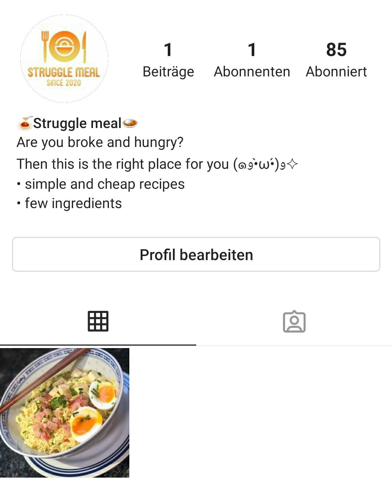

+++
title = " 𝕌𝕟𝕤𝕖𝕣𝕖 𝕀𝕟𝕤𝕥𝕒𝕘𝕣𝕒𝕞 𝕡𝕒𝕘𝕖"
date = "2021-01-20"
draft = false
pinned = false
image = "insta-logo.webp"
+++
Heute habe ich alleine gearbeitet und damit begonnen, eine Instagram page für unsere Rezepte zu erstellen. Da der Name Struggle meal schon vergeben war heisst sie jetzt struggle_meal_2020. Im Moment sieht unsere page so aus:

