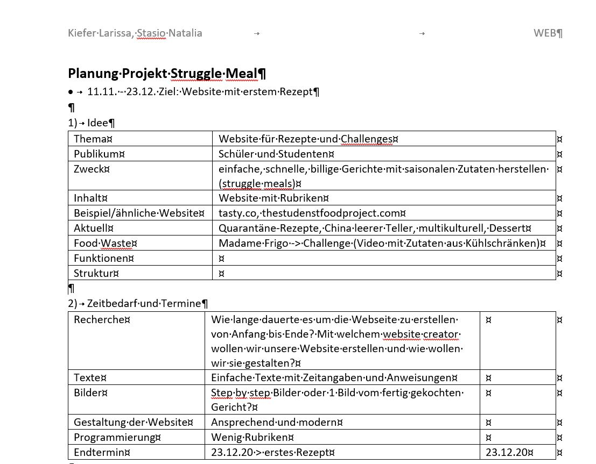

+++
title = "𝕎𝕖𝕓𝕤𝕚𝕥𝕖-ℙ𝕝𝕒𝕟𝕦𝕟𝕘 𝕚𝕟 𝟜 𝔼𝕥𝕒𝕡𝕡𝕖𝕟"
date = "2020-11-04"
draft = false
pinned = false
image = "projektplanung.png"
+++
#### code.makery

Heute haben ich und mein Teammitglied an unserer Website weiter programmiert bis zum Teil 5 auf code makery. Ich habe gelernt, dass es im Chrome-Browser die DevTools gibt, mit welchen man einzelne Elemente einer Website untersuchen kann.

#### Website-Planung in 4 Etappen

Ich und mein Teammitglied haben uns entschieden, unsere Website nicht mit Studio Visual Core zu programmieren, sondern einen website creator wie jimdo oder wix anzuwenden. Wir haben den Projektablauf in vier Etappen eingeteilt. Die vier Etappen zur Erstellung einer Website sind:

1) Idee - Definieren und Entscheiden

2) Planung - Zeitbedarf und Termine

3) Ausführung - Aufgaben und Arbeiten

4) Programmieren - Zusammenstellen und Realisieren

